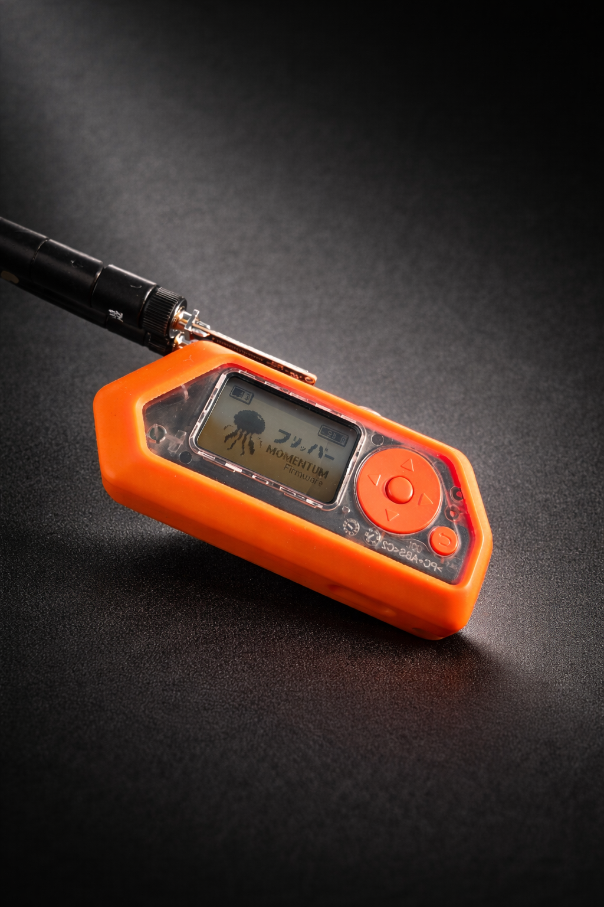

# Flipper Zero - SubGHz setting_user
Custom SubGHz settings file for Flipper Zero (compatible Momentum, ARF Firmware, Unleashed, RogueMaster).
Optimized for key fob capture at maximum range with tight noise filtering.

---

## Best Firmware for this setting_user

**🔴 ARF Firmware - https://arf.d4c1.com/ 🔴**

---

## Installation

Drop `setting_user` into:

```
SD Card/subghz/assets/setting_user
```

Restart the Flipper.

---

## Custom presets

### 🟢 Preset 1 - OOK 433 Long Range

OOK/ASK optimized for 433.92 MHz. Narrow bandwidth (58 kHz), max LNA gain, AGC tuned for weak signals. Good all-around for key fob capture.

### 🟢 Preset 2 - OOK 433 Ultra ( Recommended )

Same base as preset 1 but with the CC1101 TEST registers (`0x2C`, `0x2D`, `0x2E`) correctly set for narrow bandwidth operation. Without these the chip analog front-end is not fully calibrated regardless of other settings. This is what gives a real sensitivity gain over any standard preset. Best choice for long range capture and noisy environments like parking lots.

---

### General purpose presets

| Preset | Modulation | BW | Notes |
|---|---|---|---|
| AM_1 / AM_2 | OOK | 325 kHz | Disabled by default. Standard wide-band OOK, firmware defaults. No filtering, picks up a lot of noise. |
| A1 | OOK | 101 kHz | General purpose OOK capture. Narrower than AM_1/AM_2, more selective. Useful for unknown devices. |
| F1 | 2-FSK | 200 kHz | FSK capture, high deviation (~50 kHz). Targets garage doors, barriers and alarm remotes. |
| F2 | 2-FSK | 200 kHz | FSK variant of F1 with slightly lower data rate. Try if F1 misses a signal. |
| F3 | 2-FSK | 200 kHz | Most complete FSK preset. Full register set including TEST registers. Best FSK capture option. |
| FM95 | 2-FSK | 101 kHz | Narrow FSK, ~9.6 kBaud. For devices with tight FSK deviation, some industrial remotes. |
| FM15k | 2-FSK | 200 kHz | Low deviation FSK (~15.86 kHz). For older or low-power FSK devices. |

---

### Vehicle-specific presets

Each brand preset is tuned to the actual modulation, data rate and deviation used by that manufacturer:

| Preset | Modulation | Data rate | Frequency | Notes |
|---|---|---|---|---|
| VAG 434 | OOK | 2.4 kBaud | **434.42 MHz** | VW, Skoda, Seat pre-2009 — use with 434420000 |
| BMW - Mini | 2-FSK | 4.8 kBaud | 433.92 MHz | F/G-series, all Mini |
| Mercedes-Benz | 2-FSK | 9.6 kBaud | 433.92 MHz | W212/W213/W205 and newer |
| Honda | OOK | 1.2 kBaud | 433.92 MHz | Civic, CR-V, Jazz EU |
| AUDI - new | OOK | 2.4 kBaud | 433.92 MHz | All VAG platform EU (2009+) |
| Land Rover | OOK | 4.8 kBaud | 433.92 MHz | Defender, Discovery, Range Rover |
| Toyota - Lexus | OOK | 4.8 kBaud | 433.92 MHz | Yaris, RAV4, Prius, Lexus IS/NX |
| Subaru | OOK | 1.2 kBaud | 433.92 MHz | Impreza, Forester, Outback EU |
| Mitsubishi | OOK | 2.4 kBaud | 433.92 MHz | ASX, Outlander, Eclipse EU |
| Cadillac | OOK | 4.8 kBaud | 433.92 MHz | Export EU models |
| Chrysler | OOK | 4.8 kBaud | 433.92 MHz | Jeep, Dodge EU models |

All vehicle presets include the CC1101 TEST registers (`0x2C 0x2D 0x2E`) and max LNA gain configuration.

#### VAG 434 - Details

This preset is specifically built for older VAG vehicles (VW Golf, Polo, Passat, Tiguan, Skoda, Seat) that transmit on **434.42 MHz** instead of 433.92 MHz. It uses the same architecture as preset 2: 58 kHz bandwidth, active TEST registers, max LNA gain, 64-sample OOK averaging and 8 dB hysteresis on the AGC decision threshold. It will reject parking noise the same way preset 2 does.

---

## Usage

For generic capture on an unknown vehicle, use **preset 2**.

If you are far from the target or in a noisy environment, preset 2 will outperform any brand-specific preset.

For older VAG vehicles use **VAG 434** with frequency set to 434.42 MHz.

For garage doors, barriers or alarm remotes, try **F3** first.

---

## Notes

- Tested on Momentum firmware & ARF firmware
- Antenna matters more than any preset.
- These presets are receive-only optimized.

---

# Credits

## BY LTX

---

<p align="center">
  
</p>

---
